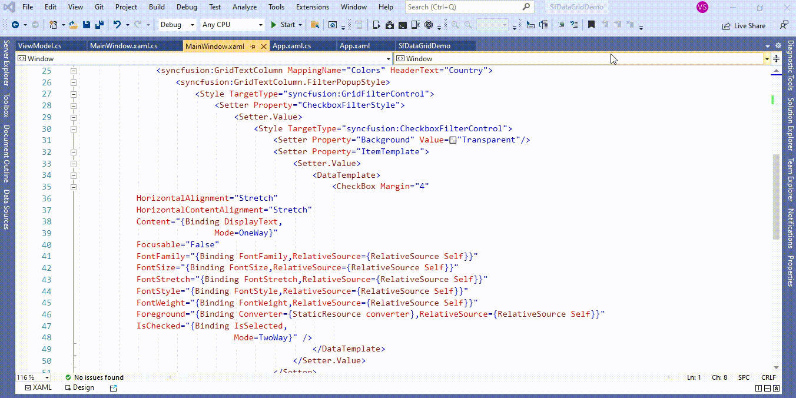

# How to change color of text in CheckBoxFilterControl based on a value in WPF DataGrid (SfDataGrid)?

## About the sample
This example illustrates How to change color of text in CheckBoxFilterControl based on a value in [WPF DataGrid](https://www.syncfusion.com/wpf-controls/datagrid) (SfDataGrid)?

[WPF DataGrid](https://www.syncfusion.com/wpf-controls/datagrid) (SfDataGrid) does not provide the direct support to change color of text in [CheckBoxFilterControl](https://help.syncfusion.com/cr/wpf/Syncfusion.UI.Xaml.Grid.CheckboxFilterControl.html) based on a value. You can change color of text in [CheckBoxFilterControl](https://help.syncfusion.com/cr/wpf/Syncfusion.UI.Xaml.Grid.CheckboxFilterControl.html) based on a value by customization [FilterPopupStyle](https://help.syncfusion.com/cr/wpf/Syncfusion.UI.Xaml.Grid.SfDataGrid.html#Syncfusion_UI_Xaml_Grid_SfDataGrid_FilterPopupStyle) in [GridTextColumn](https://help.syncfusion.com/cr/wpf/Syncfusion.UI.Xaml.Grid.GridTextColumn.html).

```XML

<syncfusion:GridTextColumn MappingName="Colors" HeaderText="Country">
                    <syncfusion:GridTextColumn.FilterPopupStyle>
                        <Style TargetType="syncfusion:GridFilterControl">
                            <Setter Property="CheckboxFilterStyle">
                                <Setter.Value>
                                    <Style TargetType="syncfusion:CheckboxFilterControl">
                                        <Setter Property="Background" Value="Transparent"/>
                                        <Setter Property="ItemTemplate">
                                            <Setter.Value>
                                                <DataTemplate>
                                                    <CheckBox Margin="4"
            HorizontalAlignment="Stretch"
            HorizontalContentAlignment="Stretch"
            Content="{Binding DisplayText,
                            Mode=OneWay}"
            Focusable="False"
            FontFamily="{Binding FontFamily,RelativeSource={RelativeSource Self}}"
            FontSize="{Binding FontSize,RelativeSource={RelativeSource Self}}"
            FontStretch="{Binding FontStretch,RelativeSource={RelativeSource Self}}"
            FontStyle="{Binding FontStyle,RelativeSource={RelativeSource Self}}"
            FontWeight="{Binding FontWeight,RelativeSource={RelativeSource Self}}"
            Foreground="{Binding Converter={StaticResource converter},RelativeSource={RelativeSource Self}}"
            IsChecked="{Binding IsSelected,
                                Mode=TwoWay}" />
                                                </DataTemplate>
                                            </Setter.Value>
                                        </Setter>
                                    </Style>
                                </Setter.Value>
                            </Setter>
                        </Style>
                    </syncfusion:GridTextColumn.FilterPopupStyle>
</syncfusion:GridTextColumn>

```

```C#

public class ColorConverter : IValueConverter
{
        public object Convert(object value, Type targetType, object parameter, CultureInfo culture)
        {
            //Get the CheckBox
            var checBox = value as CheckBox;

            //Get the content of CheckBox 
            var record = checBox.Content.ToString();

            //You can use a BrushConverter
            SolidColorBrush redBrush = (SolidColorBrush)new BrushConverter().ConvertFromString(record);

            //return the color based on DataBase text in GridFilterControl 
            return redBrush;
        }

        public object ConvertBack(object value, Type targetType, object parameter, CultureInfo culture)
        {
            throw new NotImplementedException();
        }
}

```



Take a moment to peruse the [WPF DataGrid – Filtering](https://help.syncfusion.com/wpf/datagrid/filtering) documentation, where you can find about filtering with code examples.

## Requirements to run the demo
Visual Studio 2015 and above versions
